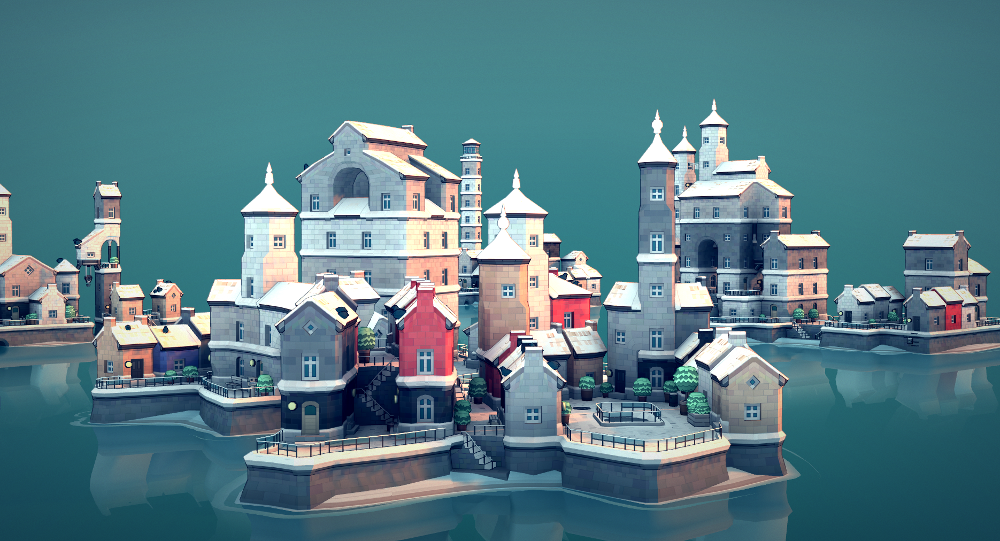
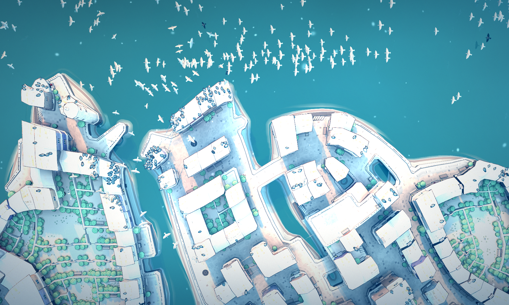
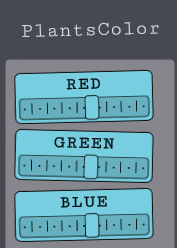

# Winter theme

Great in combinaison with the [LittleWeather](https://github.com/DigitalzombieTLD/TownscaperLittleWeather) mod. 

* Black birds!
* Snow everywhere!
* Different windows and doors!
* Red boots!
* More snow! 
* New colors! 
* ...and also very pretty at night!

_Recommendation: put the sun very low in order to not be blinded by the snow reflection._

|  |  | 
|---|---|

# [MoreBirds](https://github.com/mokojm/Townscaper-CustomBirds) mod special texture
By using the `TownColor_MoreBirds.png` special texture in this folder, you'll unlock more bird appearances. The order is the following:
1. Crow
2. Default bird
3. Seagull with black wing ends 🆕
4. Pigeon (greyscale) 🆕
5. Pigeon (colorful chest) 🆕

_Don't forget to rename it to TownColor.png to apply._

# [PlantsColor](https://github.com/mokojm/Townscaper-PlantColor) mod recommended settings

