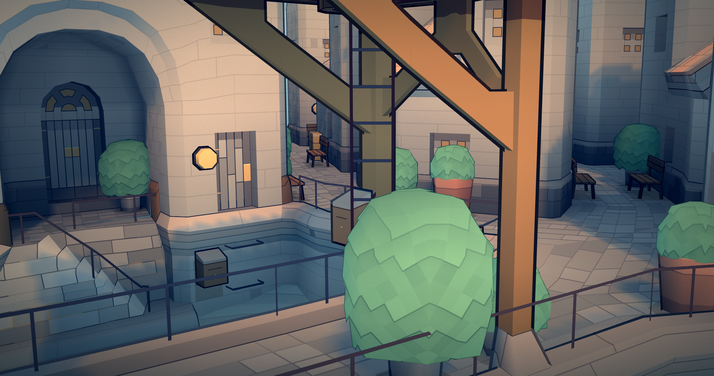
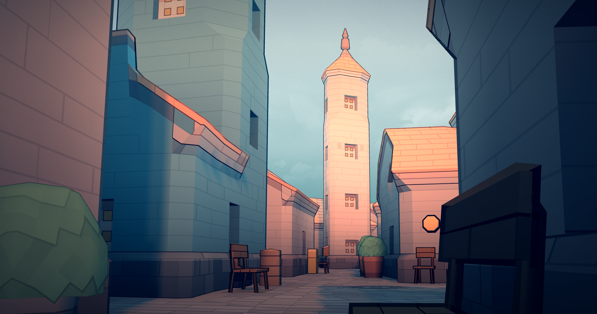

# Golden Age

A townscaper theme leaning into a Medieval style with a rich selection of earth tones and plenty of golden accents.

#### [Check out how to install this theme!](https://www.reddit.com/r/Townscaper/wiki/index#wiki_how_to_install_mods.3F)

|  |  | 
|---|---|
|  |  | 
|  |  | 

